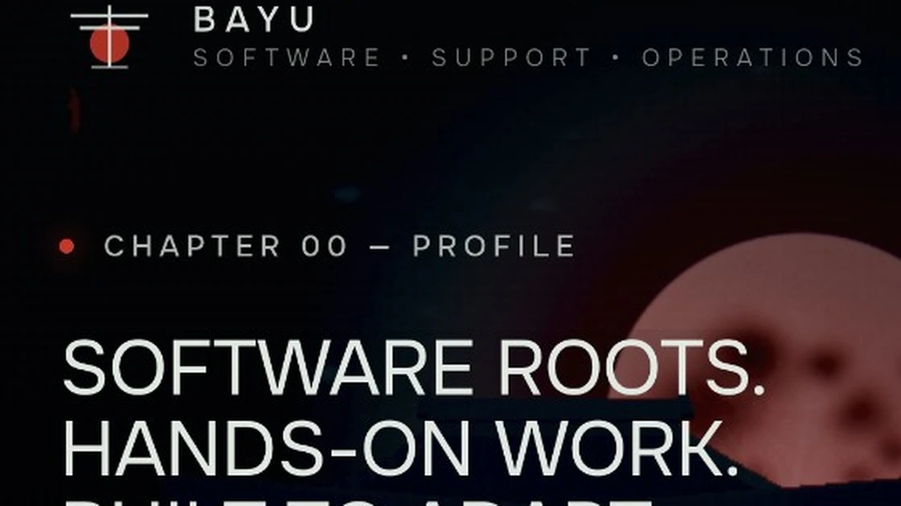

# BAYU ANDIKA — Portfolio

A cinematic interactive portfolio presenting Bayu Andika's background in **Software Engineering, IT Support, Production, Administration, and Retail Operations**.

[**View the live portfolio**](https://absoluteport.vercel.app/)



## Profile

Bayu Andika is based in Magelang with a Software Engineering foundation and hands-on experience across IT support, manufacturing, workshop administration, and retail operations.

## Experience

- **PT Indomarco Prismatama — Store Crew Boy**  
  Yogyakarta · Feb 2025 — Feb 2026  
  Display and facing, restock, receiving, cashier/POS, and FIFO/FEFO.

- **BMC Motor — Admin**  
  Yogyakarta · Nov 2024 — Jan 2025  
  Administrative documents, service information, invoices, and transaction records.

- **PT Mitra Metal Perkasa — Operator Produksi**  
  Karawang · Jan 2023 — Aug 2024  
  Production SOP, work-area discipline, stamping-press operations, quality awareness, and reporting.

- **Restu Computer — IT Support Internship**  
  Magelang · Nov 2021 — Feb 2022  
  Laptop/PC disassembly and reassembly, hardware upgrades, OS installation, and software installation.

## Education

**SMK Muhammadiyah 1 Muntilan** — Rekayasa Perangkat Lunak  
Magelang · Jul 2019 — Jun 2022

## Core Skills

- Stamping Press Operation
- Production Quality & SOP
- IT Support & Hardware
- OS & Software Installation
- Microsoft Word
- Cashier & POS
- Receiving, Display & Planogram
- Service Data Administration

## Portfolio Structure

```text
absoluteport/
├── index.html
├── README.md
├── PROMPT.md
├── assets/
│   └── kage-preview.webp
└── secret-pathways-assets/
    ├── fonts.css
    ├── three.min.js
    ├── generated/
    └── foreground/png/
```

## Technical Notes

This is a static cinematic portfolio using HTML, CSS, JavaScript, and a vendored Three.js runtime. It requires no package manager or build step for deployment.

## Attribution

The visual and interaction foundation is adapted from **Kage by Meng To**. The original Kage code and artwork remain subject to the original author's copyright and licensing terms. This repository adapts the presentation for Bayu Andika's personal portfolio content.
